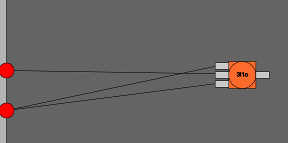

# Wiring
I spend everyday working on telling computers how to solve problem for me and I think its about time I better understand how these machines work. To do so, I want to explore logic gates and their applications without having to buy a large bread board and get stuck waiting for shipping when I unavoidably will be missing a piece. So let's code a simulation to work on. 

## Idea
Create a simulation to work with logic gates. I want ot be able to save the layout as a module that can be used later on, for example a `or` gate. This will allow me to build complex ideas and better understand the core concepts behind computers. My current end goal is building a functional RAM gadget.

## Interactive Visualization
Let's use good old Javascript. Let's set up a basic layout for us to work in. It's been a while since I've done this. I have a class called `Simulation` which will render the layout of the simulation. I want two boxes, one for the simulation to place in and a small box below it to have buttons. Next, I want a class `Gadget` which will be the information within each block. In each `Gadget`, I want to have a default layout with two inputs on the right and one output on the left. Next, I want these inputs to be clickable such that we can manually toggle the input of the gadget for testing. 


Great we have something working and is somewhat nice looking. Now let's go on a side quest and look into how to place nice wires.

## Wiring
I find it very satisfying to create clean and organized wiring. I want to have the same effect in the simulation.

### Simple Wiring
For now I will just connect gates using a straight line for the wire but let's come back to this later and us a spline!


## Gates
### Basic "and" and "not" gates
The only initial gates I'm going to give myself are "and" and "not" gates since these can be made with only signals on a bread board. Added "and" and "not" gates to the simulation with working logic. 

We have a working "or" gate use with a nand gate and not:

<video controls src="images/20250413-2020-24.3106461.mp4" title="Title"></video>


## Saving Gadgets
I want to be able to save gates as modules that I can later use. I need a way to store the information of the gates compactly. 

Let's work on this "nand" gate example:


### Saving Gadget Format
We have two inputs -> and -> not -> output. This is a `NAND` gate! I now want to save this as a custom gadget. The format that I've decided upon would read this `NAND` gate as a string of the form `AND[NOT[INPUT0],NOT[INPUT1]]`. For now, let's assume that there is only one output and two inputs. Let's start at the output, and on each step, look back. So for an `OR` gate:

```
1. OUTPUT
2. AND -> OUTPUT : "AND[_,_]"
3. [NOT[_], _] -> AND -> OUTPUT : "AND[NOT[ ],_]"
4. [NOT[INPUT1], _] -> AND -> OUTPUT : "AND[NOT[INPUT1],_]"
5. [NOT[INPUT1], NOT[_]] -> AND -> OUTPUT : "AND[NOT[INPUT1],NOT[_]]"
6. [NOT[INPUT1], NOT[INPUT2]] -> AND -> OUTPUT : "AND[NOT[INPUT1],NOT[INPUT2]]"
```

We can do this with a recursive function, terminating when the type of the item is `input`.

```
1. OUTPUT
2. AND -> OUTPUT : "AND[_,_]"
- 1. [NOT[_], _] -> AND -> OUTPUT : "AND[NOT[ ],_]"
- - 1. [NOT[INPUT1], _] -> AND -> OUTPUT : "AND[NOT[INPUT1],_]"
- 2 [NOT[INPUT1], NOT[_]] -> AND -> OUTPUT : "AND[NOT[INPUT1],NOT[_]]"
- - 1 [NOT[INPUT1], NOT[INPUT2]] -> AND -> OUTPUT : "AND[NOT[INPUT1],NOT[INPUT2]]"
```

Let's  write some code to do this:
```
simplify(output, code){
    let guy_before = output.start
    let name_of_guy_before = guy_before.name;

    console.log("name_of_guy_before: " + name_of_guy_before);
    console.log("code: " + code);

    if (name_of_guy_before == "input") {
        console.log("input found: " );
        code = code.replace("_", "input" + guy_before.id);
        console.log("replaced code: " + code);
        
        return code;
    }

    if (name_of_guy_before == "not") {
        console.log("not found: " );
        code = code.replace("_", "NOT[_]");
    }

    if (name_of_guy_before == "and") {
        console.log("and found: " );
        code = code.replace("_", "AND[_,_]");
    }
    console.log("replaced code: " + code);

    for (let i = 0; i < guy_before.inputList.length; i++) {
        let input = output.start.inputList[i];
        code = this.simplify(input, code);
    }
    return code;
}
```
Not the cleanest but gets the trick done! Now clicking 'Create' for the `NAND` get gives `NOT[AND[input1,input0]]`. Wonderful. Now let's this string a pair `(name, command)` in a text file called `gadgets.txt`:

```
NAND NOT[AND[input1,input0]]
OR NOT[AND[NOT[input1],NOT[input0]]]
XOR NOT[AND[NOT[AND[NOT[input0],input1]],NOT[AND[input0,NOT[input1]]]]]
```

### Loading Gadget Format
Okay I've added the logic to load the gadgets in. How it works is when the user presses the `Load` button, the simulation reads the `gadgets.txt` file and loads in the `(gadget_name, gadget_rule)` pair. The simulation also gives all the details to the current gadget module. Now the simulation also creates now buttons for the user to click. I've also added a new class called `CustonGadget` which takes in the custom name and custom rule. Now we need to write function that takes the rule and returns a `0` or `1`.


### Running Gadget
Let's create a function that updates the state of the custom gadget depending on its input values and the rule. We will need to create another recursive function that loops through each argument until we get to the input values and the move back out, returning if the statement is true or false. And here is a function that does the trick:
```
function evaluateRule(exp, inputList) {
    if (inputList.length != 2) {
        return;
    }

    // replace 0 and 1 with true and false
    let input0 = inputList[0] == 1 ? true : false;
    let input1 = inputList[1] == 1 ? true : false;   
    
    // replace this.rule input0 and input1 with the actual values
    let rule = exp.replace(/input0/g, input0).replace(/input1/g, input1);
    console.log("Rule: " + rule);

    // Recursively evaluate the expression
    function parse(expr) {
        // Evaluate NOT
        if (expr.startsWith('NOT')) {
            let inner = expr.slice(4, -1); // Remove NOT[ and ]
            return !parse(inner);
        }

        // Evaluate AND
        if (expr.startsWith('AND')) {
            let inner = expr.slice(4, -1); // Remove AND[ and ]
            let parts = splitArgs(inner);
            return parts.every(parse);
        }
        // Base case: just return the boolean
        if (expr.trim() === 'true') return true;
        if (expr.trim() === 'false') return false;
    }

    // Split arguments on comma, but respect nested brackets
    function splitArgs(s) {
        let args = [], depth = 0, current = '';
        for (let c of s) {
            if (c === '[') depth++;
            if (c === ']') depth--;
            if (c === ',' && depth === 0) {
                args.push(current.trim());
                current = '';
            } else {
                current += c;
            }
        }
        if (current) args.push(current.trim());
        return args;
    }

    return parse(rule);
}
``` 
The algorithm takes in the command and calls two subfunctions, `parse` and `splitArgs`. Parse takes in a command and checks the first three letters to see if it is `AND` OR `NOT`. If `NOT`, then take everything between `[` and `]`, and return `!parse(inner)`. To tackle `AND` is a little more complex, we loop through the string, keeping track of how many `[` and `]` we encounter. We add one to the counter when hitting `[` and remove one from the counter when hitting `]`. To make sure this works for nested brackets, we will take everything in-between the first `[` and the last `]`. We know when we are at the first and last when the count is equal to zero. Now we take his expression, and using a similar logic, split at the `,` at `depth=0`. Now we can split the `inner` by this comma and pass both `inner` parts back into the parse command, only returning true if both results are true. Let's see if it works:

<video controls src="images/20250416-0456-59.0252236.mp4" title="Title"></video>

Yay, it does!

### Recursively Saving Gadgets
Now I want to be able to build gadgets using my previously made gadgets. TO do this, we can use our previously made save function but now the swapping custom gadgets with their rules. This will result in one large statement that contains only `AND` and `NOT` commands. Adding the following command to `gadget.simplify` does the trick:
```
// hit a custom gadget
else {
    // find the number of inputs in the gadget
    let num_inputs = guy_before.inputList.length;
    console.log("Number of inputs", num_inputs);
    let rule = guy_before.rule;
    // replace the inputs with "_"
    for (let i = 0; i < num_inputs; i++) {
        let input = "input" + i;
        console.log(input);
        rule = rule.replace(input, "_");
    }
    code = code.replace("_", rule);
}
```
We take the rule of the custom gadget, that comprises of `AND` and `NOT` and add this to the string of commands. 

### Custom Appearance
We will come back to this later.

## Multiple Inputs and Outputs
I've added buttons that allow the user to create more than one input and output. Now we need to make sure that our functions to save gadgets can handle this. Currently, I pass the first output into my `gadget.simplify` function which reduces the current set up to a string. Let's first focus on making sure this function can handle more than one input:


And running save yields `test AND[input2,AND[input0,input1]]` which seems correct! Let's see if it currently loads back in. And it works! Great, now to allow multiple outputs. I think this will require a slight modification of how we are saving the gadgets. Rather than having 
```
name rule
```
I will make it have
```
name [rule1, rule2, ..., rulen]
```
where each element of the array corresponds to an output. And here we go:

```
this.createCreate.mousePressed(() => {
    // prompt the user for the name of the gadget
    let name = prompt("Enter the name of the gadget:");

    let outputs = [];
    for (let i = 0; i < this.gadget.outputList.length; i++) {
        let output = sim.gadget.simplify(sim.gadget.outputList[i].inputList[0],"_");
        outputs.push(output);
    }
    
    let rule = "[";
    for (let i = 0; i < outputs.length; i++) {
        rule += outputs[i];
        if (i < outputs.length - 1) {
            rule += ",";
        }
    }
    rule += "]";
    let data = name + " " + rule;

    // append the (name, output) to a text file gadgets.txt
    // display data
    alert(data);
});
```
Running this function on this:


yields:

```
test [AND[input0,input1];AND[input0,input1]]    
```

Now we need to modify our `customgadget` object to be able to handle multiple outputs as well. In the `customgadget` we load in the outputs

```
setupRules(rulesData) { 
    let rules = rulesData.substring(1, rulesData.length - 1).split(";");
    this.numberOfOutputs = rules.length;

    for (let i = 0; i < rules.length; i++) {
        this.rules.push(rules[i]);
    }
}
```

and looping through our evaluation function 

```
evaluateRule() {
    if (this.inputList.length != 2 || this.rules.length == 0 || this.outputList != this.numberOfOutputs) { 
        return;
    }
    ...
   for (let i = 0; i < this.rules.length; i++) {
        // replace 0 and 1 with true and false
        let input0 = this.inputList[0].state == 1 ? true : false;
        let input1 = this.inputList[1].state == 1 ? true : false;   
        
        // replace this.rule input0 and input1 with the actual values
        let rule = this.rules[i].replace(/input0/g, input0).replace(/input1/g, input1);
                
        this.state[i] = parse(rule);
    }
}
```

Okay now we need to change how the wire checks the state since it is used to looking for `state`. Okay so I've realized that my code is getting sloppy because I started off with the assumption that `AND` and `NOT` gates have one output. While this isn't false, in retrospect, I still should have make this an array of one boolean value rather than a boolean variable. I've work around this by having cases. One case is if a wire's parent doesn't have more than one output and the other case is if the parent does have more than one. In the latter case, I pass an index to the wire so that it knows which output in the array of boolean values it should check to determine its own state. This does the trick! Let's take a break from all this designing and start making some gadgets!


## Binary Addition
Let's make a binary adder! Let's think of adding two bits together. Let's run through what the truth table would be:

$$
\begin{array}{c|c|c|c}
\text{in} 1 & \text{in } 2& \text{out} & \text{carry} \\
\hline
0 & 0 & 0 & 0 \\
0 & 1 & 1 & 0 \\
1 & 0 & 1 & 0 \\
1 & 1 & 0 & 1 \\
\end{array}
$$
Looking at the `out` label, notice this is the same as a `XOR`. Notice that the carry is given by an `AND`:
 

This does the trick. Now to make this extendable, we need to allow an input to carry in. We can build the correct modification by looking at the previous output with the addition of a carry in. Let's first look when `carry in` is 1: 

$$
\begin{array}{c|c|c|c}
\text{prev. out} & \text{carry in} & \text{out} & \text{carry out}\\
\hline
0 & 1 & 1 & 0\\
1 & 1 & 0 & 1\\
1 & 1 & 0 & 1\\
0 & 1 & 1 & 1^*\\ 
\hline
0 & 0 & 0 & 0\\
1 & 0 & 1 & 0\\
1 & 0 & 1 & 0\\
0 & 0 & 0 & 1^*\\ 
\end{array}
$$

where the $1^*$ come from the previous truth table. Notice that `out` is now a `XOR` between the `prev. out` and `carry in`. To figure out `carry out`, we see that, `carry out` is a `AND` between the `carry in` and `out` `OR` a gate between `input 1` `and` `input 0`.Let's wire this up:


Oops.. 

### Squash a bug

When we add another wire to a `customGadget`, it does not point towards the correct outputs. I think we can fix this by checking if a custom gadget has a wire and if so, copy the object. This way, all new outputs will be the same. Hmm okay, I'm seeing the problem here, we don't always want this behavior. So I think we need to first visual our custom gates better. Let's add visual representation of the inputs and the outputs. This way the user can easily click the desired input/output. If the user clicks a output that has an existing wire, copy it. A somewhat easier way around this is to make wires clickable, and then we take the value off the wire. We want both but maybe let's just add the wire click, finish making the adder, and come back to make the gadgets look pretty. We also need to update the UI soon. 


#### Designing
Never mind let's mess with how they look:


The number of inputs and outputs are adaptive to the number of inputs and outputs found in the `customgadget`'s rule. Got edge detection working:

<video controls src="images/20250424-0538-16.0883793.mp4" title="Title"></video>

## Returning to the Project
It has been a month or so since I've worked on this project last. Trying to get back into the project shows me how much spaghetti code I've written. It is super hard to follow and understand what is going on. Rather than re-writing the program, I'm going to take some time to organize and comment my code. Every time I edit a function, I want to make sure that I add comments about what the function is doing. For classes, I want to keep track of where the main loop is being called from. This should help make the code more readable and flow slightly better.

### Finishing Wiring
#### Input Logic
I've added so that the wire correctly links up with input that the mouse is hovering over:


I've spent sometime rethinking the wiring function. I have it so that the wire will only be added to the input/output when the mouse is hovering over these. I also worked on the logic for connecting custom items together. I still need to make sure that the input that is clicked, corresponds to that input location in the logic of the custom gadget. I also have to make inputs, outputs, AND, and NOT gates align with this new set up.

Okay I got the input and output wiring logic working. This means that we just need to make sure that the clicked input and output of an item correspond with its position in the logic. I've figured this out before but overwrote it. So let's double check how I did that. Finally we need to add all this logic to AND and NOT gates. Eventually we need to turn all of these into custom items.

Okay got AND gate working.


## TODO
Okay I'm leaving off at a point where I can click on a button that actives wiring mode. Once in wiring mode, the user can click on on items to begin a wire. The logic for this cascades from the simulation to the gadget. The next step would than be to:
- [ ] Allow the user to click on not an item to add a intermediate step in the wire.
- [ ] When the user clicks a wire, remove it
- [ ] Annoying to keep pressing wire mode.
- [ ] Remove the hard corners
- [ ] Have gadgets be able to save when they have custom gadgets within them.
- [ ] Customize the look of the gadgets to show how many inputs and ouputs there are. 
- [x] Generalize everything to handle a general amount of inputs and outputs.
- [x] Add an `and` gate. For now lets just add a gate that will take two inputs. We will add the actual logic later. This is just to be at a spot of basic wiring.
- [x] If the user clicks on another item, complete the wire. This means, turn wiring_mode off for both the simulation and the gadget and add a new wire to the gadget. The logic for this should all be stored within the gadget class. 
- [x] Add an output for the `and` gate.
- [x] Add correct logic for inputs, `and` gates, and outputs.
